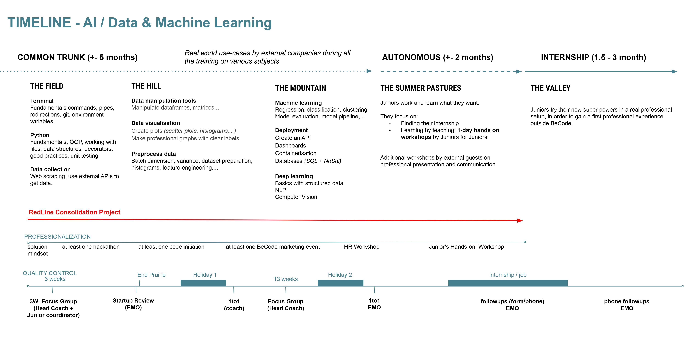

# AI-track

Work file by Yuri Hernandez Flores

## Course Overview

The course's main purpose is to _bridge the gap_ between curious and solution oriented _individuals_ and _companies_ in need of capable people. It is to provide the most fundamental knowledge to the students so that they can understand what AI is.

Note: The ultimate goal is the mindset, not specific tools. For that reason the timeline above may vary during the course and the tech mentioned might be replaced by others or not seen at all.

| Content                                         | Description                                                                                                                           |
| ----------------------------------------------- | ------------------------------------------------------------------------------------------------------------------------------------- |
| [Tech Talks](https://my.becode.org/tech-talks/) | Small daily talks organized by the learners or coaches on theoretical concepts, interesting related tech, cool findings, etc…         |
| [Workshops](https://my.becode.org/tech-talks/)  | Interactive session given by the trainees on subject they want to teach their colleagues.                                             |
| Red Line                                        | A growing project during all the course where the team role-plays as a startup facing growing AI problems (consolidation challenges). |
| Case Study                                      | Study of real life cases of AI, well known hacks and advice from professionals.                                                       |

| Field                                                                            |                                                                                                                                                                                                                                                 |
| -------------------------------------------------------------------------------- | ----------------------------------------------------------------------------------------------------------------------------------------------------------------------------------------------------------------------------------------------- |
| [Terminal](https://github.com/becodeorg/ANT-Theano-4/tree/master/content/1.terminal) | Introduction to the fundamentals of the command line interface (Unix/Linux) such as navigation, file operation, permissions, package management, text edition, pipes, FIFO, re-directions, environment variables and versioning tools like git. |
| [Python](https://github.com/becodeorg/ANT-Theano-4/tree/master/content/2.python)   | Introduction to the language fundamentals in order to execute simple tasks. Understanding the OOP principles and the processes that are required to work with all kinds of files that contain data.                                             |

| Hill                                                                                                                    |                                                                                                                                                                                                                                                                                           |
| ----------------------------------------------------------------------------------------------------------------------- | ----------------------------------------------------------------------------------------------------------------------------------------------------------------------------------------------------------------------------------------------------------------------------------------- |
| [Data tools]                                    | Get familiar with all the necessary libraries such as [NumPy](https://numpy.org/), [Pandas](https://pandas.pydata.org/) and [matplotlib](https://matplotlib.org/) so the preprocessing of data can be done in a quick and "clean" way. You'll also learn how to scrap data from websites. |
| [Data preprocessing] | Learn how to preprocess data for a machine learning model, whether it be tabular data or images.                                                                                                                                                                                          |

| Mountain                                                                                         |                                                                                                                                                                                                                                                                                               |
| ------------------------------------------------------------------------------------------------ | --------------------------------------------------------------------------------------------------------------------------------------------------------------------------------------------------------------------------------------------------------------------------------------------- |
| [Machine Learning] | In machine learning, dealing with data is the most time-consuming process, so learning techniques such as cleaning data, histograms, etc, will make the data preparation more accurate. You'll also get familiar with procedures such as regression, classification, model evaluation, etc... |
| [Databases & Deployment] | Learn how to store data in databases and to deploy a web service which can be accessed from anywhere in the world using a REST API and Docker.                                                                                                                                                |
| [Deep Learning]       | Start with building a simple neural network from scratch and finally interact with Keras, PyTorch and OpenCV, will lead you to solve challenges in fields such as Computer Vision and Natural Language Processing (NLP).                                                                      |

## Requirements

List of minimal requirements for the trainees:

- junior development skills (in any programming language)
- basic math & statistics knowledge
- fundamental computer know-how (interested in tech, tech-savvy)
- problem solver mindset
- motivated
- self-learner

## Course content

BeCode promotes a learning experience based on _projects rather than lessons_.
With that in mind this course content has been divided in multiple categories of
challenges, resources and other tools aiming to teach specific sets of skills.

## Target skills

With an ever-growing and changing set of _things to know_ we made choices so
that, by the end of the training, the learner will have acquired the following
technical foundations and soft skills.

### Tech skills

By the end of the common trunk, trainees should have acquired a good
_infrastructure affinity_, good _coding background_ (with good practices and
secure coding) and the fundamentals of _ΑΙ_ and _data science_, allowing them to continue
learning on their own and in the work place.

More specifically:

- Able to deconstruct falsehood.
- General knowledge, competences and good practices.
- Able to understand modern tools and techniques.

### Soft skills

- Continuous Learner: Eager to learn, professional learner.
- Team Player: Helps, asks for help, takes its share of the collective load,
  give and takes constructive feedback.
- Reliable: Trustworthy, committed, punctual.
- Change Enthusiast: Flexible, solution mindset.

### Careers

With this training, our learners should be able to pursue the following career paths, to continue learning while acquiring battlefield experience:

- **Data analyst** : Data analysts are focused on Business development : they sift through data and seek to identify trends. What stories do the numbers tell? What business decisions can be made based on these insights? They may also create visual representations, such as charts and graphs to better showcase what the data reveals.
- **Data Scientist** : Data Scientists develop, construct, test and maintain architectures, such as databases and large-scale processing systems.
- **Machine Learning Engineer** : The ML Engineer is an expert in using data to training models. The models are then used to automate processes like image classification, speech recognition, and market forecasting.

BeCode helps graduates find an internship, hopefully converting into a job that they like, and at the same time, help partner companies staff up with our autonomous, eager to learn and reliable talents.
