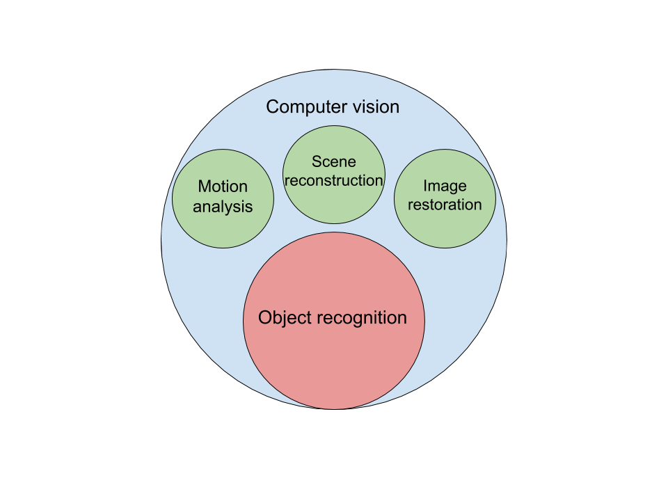
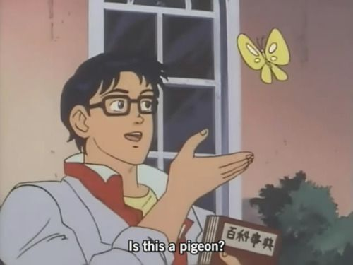

# Introduction

The world of **computer vision** is composed of a number of subdomains, each of which is very interesting and highly correlated. The subdomain of computer vision which is most often talked about when discussing **deep learning** is **object recognition**, and is the subject in which we will further ourselves during this chapter.

## What is object recognition?

Simply put, object recognition is the **classification** of objects through the use of **convolutional neural networks**. These neural networks differ in structure from a traditional neural network to take advantage of the **2D data format** images are provided in.

As with other NN's, these networks need to be trained with **labeled data**, since object recognition is a **supervised learning method**.

By feeding an image **pixel-per-pixel** to a trained neural network, it will be processed by layers dedicated to **convoluting**, **pooling** and **abstracting** the whole image, hopefully identifying the object that is made up by all those individual pixels.

## Why use object recognition?

The name of the technique already tells you the goal, to recognize objects! But why would you want to do this?

- **Data reduction**: images are data-heavy, in the sense that they contain an enormous amount of individual pixel data, while you might only want to know the object it represents. A 5 MB high definition picture of your dog sure is cute, but not really efficient if all you want is a representation of a 'dog'. The 3-character representation of that info did just fine.
- **Anomaly detection**: there are some things AI is already better at than humans, such as anomaly detection. Finding Wally in your favorite 'Where's Wally?' picture-book is a nice way to spend your leisure time, but a trivial task for a well-trained CNN. This technique is also already being used in some hospital environments to detect potential diseases on X-ray images. If a neural network is trained on thousands of these images, all already correctly diagnosed, it can predict new diagnoses pretty well.
- **Information extraction**: a fancy way to say "what's in this picture?". This is a classic CNN problem, where the neural network tries to classify the content of a picture, out of many possible classes.

## Expected knowledge after completing this chapter

Below, you can see the contents of this chapter divided in two main parts: Must-haves and Nice-to-haves. This chapter is quite big, so you will need to prioritize what you'll learn. If you are stuck on things that are not essential to this chapter, you'd do well to focus on the must-haves instead.

### Must-haves

- Preprocessing
  - Image manipulation
  - Image contrasting/cleaning
- Object recognition
  - Pre-trained model usage
    - Keras
    - Pytorch
  - Transfer learning
    - Keras
    - Pytorch
  - Drills
    - Full-color dataset
    - Feature mapping
- Challenge
  - Object recognition transfer learning challenge

### Nice-to-haves

- Preprocesssing
  - Shape detection
- Object recognition
  - Model from scratch
    - Keras
    - Pytorch
  - Pre-trained model usage
    - OpenCV
  - Drills
    - Multiple classes from scratch

## Some further reading

Here are some sources on CNN's, both practical and theoretical.

- [Comprehensive guide to CNN's, simplified](https://towardsdatascience.com/a-comprehensive-guide-to-convolutional-neural-networks-the-eli5-way-3bd2b1164a53)
- [A more in depth article on how CNN's work, with pretty gifs](https://towardsdatascience.com/intuitively-understanding-convolutions-for-deep-learning-1f6f42faee1)
- [Even more in depth info on CNN kernels](https://www.sicara.ai/blog/2019-10-31-convolutional-layer-convolution-kernel)
- [The nitty gritty on CNN's from Goodfellow](https://www.deeplearningbook.org/contents/convnets.html)
- [A short and sweet explanation on convolutional layers](https://www.youtube.com/watch?v=YRhxdVk_sIs&ab_channel=deeplizard) (she also has relevant other videos on the subject)
- [A nifty visualization on both regular and convolutional neural nets](https://www.youtube.com/watch?v=3JQ3hYko51Y&ab_channel=DenisDmitriev)
